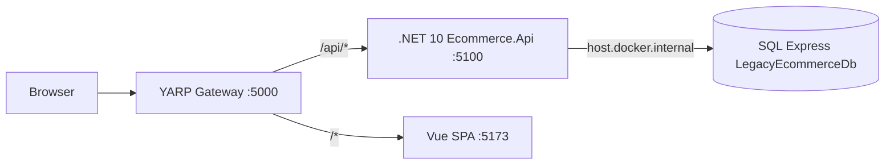

# Target architecture



## Runtime split (hard rule)

| Piece | Where it runs | Notes |
|-------|---------------|--------|
| **SQL Express** `LegacyEcommerceDb` | **Host Windows** (not Docker) | Shared with legacy MVC; no SQL container |
| **Ecommerce.Api** | Docker Compose | Connects out to host SQL via `host.docker.internal` |
| **Ecommerce.Gateway** (YARP) | Docker Compose | Browser entry on host port `5000` |
| **ecommerce-web** (Vue) | Docker Compose | Dev: Vite; prod image may use nginx static |

## Ports (published to host)

| App | Host port | In-compose service | Role |
|-----|-----------|--------------------|------|
| YARP Gateway | `5000` | `gateway` | Browser entry |
| Ecommerce.Api | `5100` | `api` | REST + JWT |
| Vue | `5173` | `web` | SPA (proxied by gateway) |
| Legacy IIS (optional, parity only) | `44300` | — | **Not** used by modern product runtime |

## Auth
- `POST /api/auth/login` → JWT (`Issuer`/`Audience` = `Ecommerce.Api`)
- Password hashes: ASP.NET Identity compatible (`PasswordHasher<AspNetUser>`)
- Roles from `AspNetRoles` / `AspNetUserRoles`; admin policy requires role `Admin`
- API startup: `AdminUserSeeder` ensures admin user/role

## Data access
- **Native SQL only** via `Microsoft.Data.SqlClient` (optional Dapper).
- **No** EF Core / `DbContext` / EF migrations.

## DB connectivity from containers
- Connection string (Docker): use **TCP** to host SQL Express, e.g.  
  `Server=host.docker.internal,1433;Database=LegacyEcommerceDb;Trusted_Connection=False;User Id=...;Password=...;TrustServerCertificate=True`  
  **or** Windows auth via configured SQL login (recommended for containers).
- Connection string (host unit tests / local `dotnet run`):  
  `Server=.\SQLEXPRESS;Database=LegacyEcommerceDb;Trusted_Connection=True;TrustServerCertificate=True`  
  (named pipes / LPC OK on host).
- **OPEN QUESTION:** Prefer SQL login `ecommerce_app` vs Trusted_Connection from Docker.  
  **Default:** create a SQL login for Docker API; keep Windows auth for host `dotnet test`. Document both in `appsettings.Docker.json`.
- Prerequisites on host: SQL Express **TCP/IP enabled**, Browser service running, firewall allows container → host `1433` (or Express dynamic port — prefer fixed `1433`).

## Final modern product routing
- **No** YARP routes to legacy MVC for shop/admin.
- Vue may redirect old casings (`/Cart` → `/cart`, `/Product/Detail/:id` → `/products/:id`, etc.).

## Suggested modern layout
```
modern/
  Ecommerce.Api/
  Ecommerce.Api.Tests/
  Ecommerce.Gateway/
  ecommerce-web/
  Ecommerce.Modern.sln
  docker-compose.yml
  docker-compose.override.yml   # optional local mounts
  .dockerignore
  Ecommerce.Api/Dockerfile
  Ecommerce.Gateway/Dockerfile
  ecommerce-web/Dockerfile
tools/modern-up.ps1             # wraps: docker compose up --build
tools/db-setup.ps1              # host SQL Express only (SQLCMD)
database/                       # existing scripts (shared; run on host)
```
